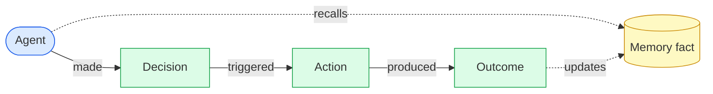
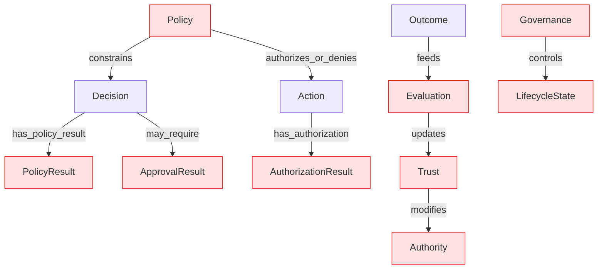
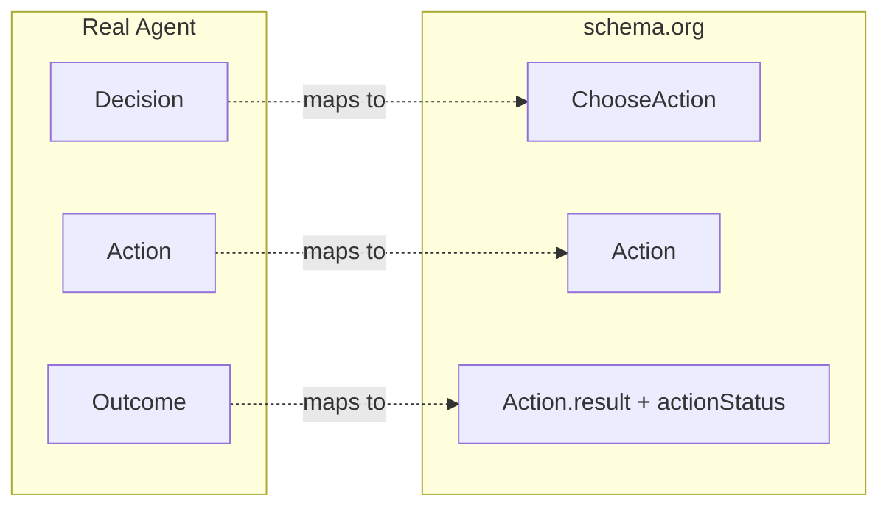

# Real Agent graph map

Status: Informative

Visual companion to [ONTOLOGY.md](../ONTOLOGY.md), the record
[`schemas/`](../schemas), and [schema-org-mapping.md](./schema-org-mapping.md).
Diagrams render inline on GitHub.

## The agent loop

The causal chain the spec requires — every pass produces a decision record
(SPEC §6) — modelled as the SurrealDB graph edges in
[`reference/surrealdb/memory.surql`](../reference/surrealdb/memory.surql).

## Governed extension

The enterprise graph adds the accountability primitives (SPEC §4.8,
ONTOLOGY "Enterprise Graph Extension"). schema.org has **no** equivalent for
these — they stay in the native contract.

## schema.org overlay

Where the loop maps onto [schema.org](https://schema.org) (export/interop
view only — see [schema-org-mapping.md](./schema-org-mapping.md)).

